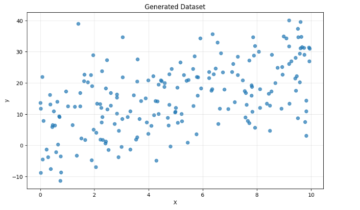
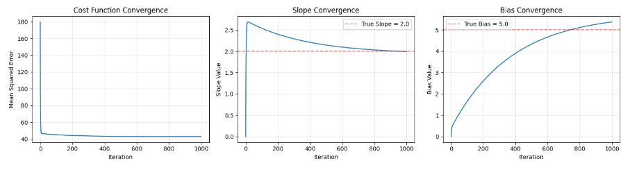
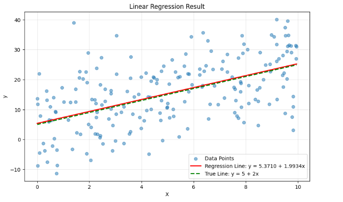
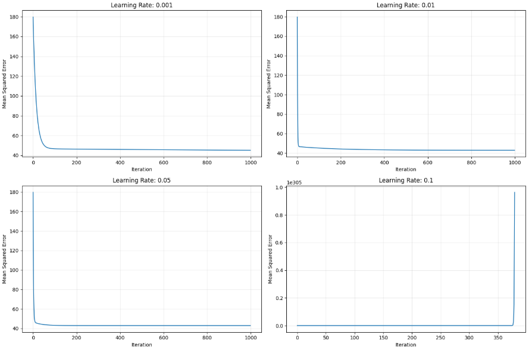

# Linear Regression with Gradient Descent

This repository contains an implementation of linear regression using gradient descent for a university Machine Learning course assignment.


## Project Overview

This implementation focuses on developing a linear regression model from scratch using the gradient descent optimization technique. The primary goal is to understand the fundamentals of linear regression and gradient descent algorithms without relying on machine learning libraries.

The implementation includes:
- Data generation using NumPy
- Gradient descent algorithm implementation
- Cost function calculation (Mean Squared Error)
- Visualization of the optimization process
- Analysis of different learning rates

## Requirements

- Python 3.x
- NumPy (for data manipulation and calculations)
- Matplotlib (for visualization only)

## Implementation Details

1. **Data Generation**
   - 200 samples generated with a true linear relationship (y = 5 + 2x) plus Gaussian noise
   - Data points scatter visualization

2. **Model Implementation**
   - Mean Squared Error (MSE) cost function
   - Gradient computation for slope and bias parameters
   - Gradient descent algorithm implementation

3. **Learning Rate Analysis**
   - Comparison of convergence with different learning rates (0.001, 0.01, 0.05, 0.1)
   - Visual and numerical analysis of convergence properties

## Results

The implementation achieved the following results:
- Slope: 1.9385 (True value: 2.0)
- Bias: 5.7454 (True value: 5.0)
- Final MSE: 42.8987

Learning rate analysis demonstrated that:
- Too small (0.001): Slow convergence, doesn't reach optimal values within 1000 iterations
- Good (0.01): Effective convergence to near-optimal values
- Best (0.05): Fastest convergence to lowest MSE
- Too large (0.1): Divergence and numerical instability (overflow)

## File Structure

- `linear_regression_gradient_descent.ipynb`: Jupyter notebook with the complete implementation
- `linear_regression_gd.py`: Python script version of the implementation
- `README.md`: This documentation
- `requirements.txt`: Project dependencies

## Usage

To run the notebook:
1. Open the notebook in Jupyter or any compatible environment
2. Run all cells to see the complete implementation and results

To run the Python script:
```bash
  python linear_regression_gd.py
```

## Screenshots

### Generated Dataset


### Convergence Visualization


### Final Regression Line


### Learning Rate Comparison


## License

[MIT License](LICENSE)